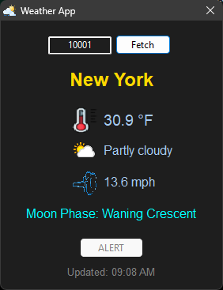

# Weather App

A simple desktop weather application for Windows that shows current weather conditions, forecasts, and alerts for any US zip code.

## Features

- **Current Weather**: Displays temperature, conditions, and wind speed
- **Moon Phase**: Shows the current phase of the moon
- **Weather Alerts**: Get notified of severe weather warnings in your area
- **Auto-Refresh**: Weather data updates automatically every 10 minutes
- **Remembers Your Location**: Saves your zip code and window position

## Getting Started

1. Download and run `Weather.exe`
2. Enter your zip code in the text box
3. Click the **Fetch** button to get your weather

That's it! The app will remember your zip code for next time.

## Configuration

The `config.json` file stores your API key, zip code, and window position. If you need to change these settings, you can edit this file directly or use the app's interface.

## Credits

Weather data provided by [WeatherAPI.com](https://www.weatherapi.com/)

## License

This project is released into the public domain under the Unlicense. See the `LICENSE` file for details.

---

*A lightweight, standalone weather application built with FreePascal and Lazarus LCL.*
